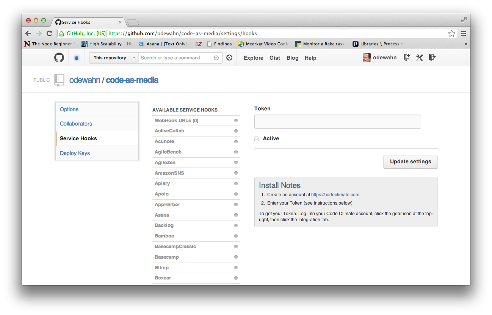

Code Analysis and Metrics
=========================

This section covers services that evaluate a code repo and create
ancillary material for it. For example, a service might compute various
metrics (code coverage for a test suite, etc), project management assets
(for example, it sends a message to a chat service when someone
commits), documentation (rebuilds automated docs on each commit), or
other software engineering-related items.

The tools are often implemented as webhooks within a CI server (Jenkins,
etc) or in the underlying version control system. These services can
either be free or paid. If they’re paid, they’re typically implemented
by having the user register for a paid service and enter some sort of
authorization token into the web hook. ?, for example, shows how paid
service is configured in GitHub’s "Service Hooks."

Examples of metrics include:

CodeClimate
-----------

[CodeClimate](https://codeclimate.com/) provides automated Ruby code
review. You give it a repo by (among other ways) creating a GitHub
service hook, and it will give you back some reports. It’s a paid
service with a tiered pricing scheme.

Documentation Generators
------------------------

This section covers tools that build documentation directly from the
source code itself. This idea, called [literate
programming](http://en.wikipedia.org/wiki/Literate_programming), was
invented by Donald Knuth as a way to create self-documenting programs.
The technique is used by many languages to create reference and API
documents and sites.

Key tools include:

-   Sphinx. Documentation generator for Python.

-   JavaDocs. Documentation for Java.
