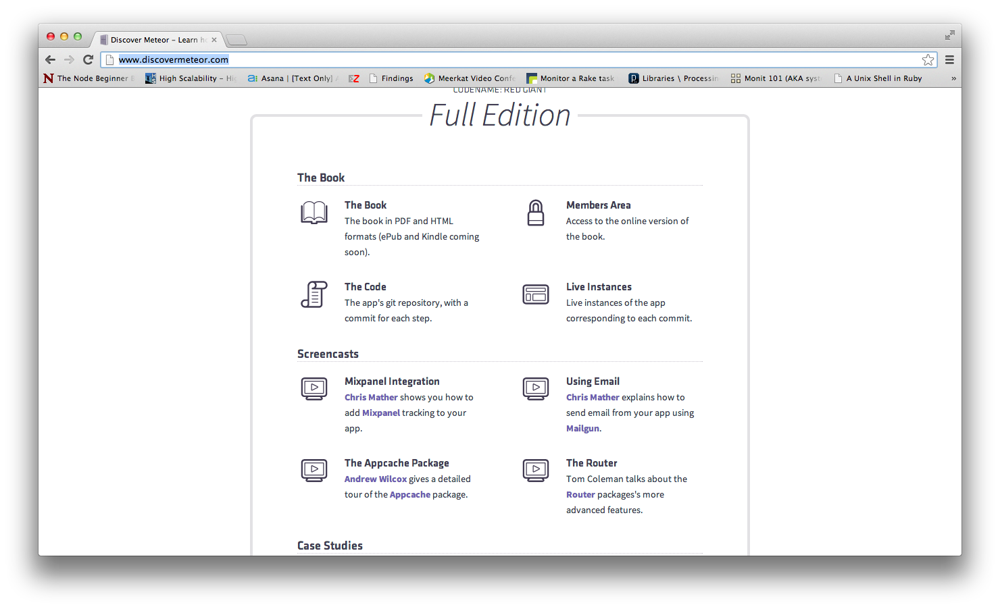

Code Evolution
==============

Examples in this category show how code evolves over time. For example,
you might break a complex example down into a series of steps. At each
change point, you show how the code progresses between steps.

Text-Based Description
----------------------

This is the standard tech book approach — have a narrative series of
listing that shows the code at each point, and describe the changes
between each.

Meteor Book
-----------

[The Meteor Book](http://www.discovermeteor.com/) has a nice system that
uses commits at each checkpoint so that the user can check out the code
that corresponds to a specific section of the example. The nice thing
about this method is that it allows the author make changes in a natural
way that is similar to how they would work with code.

Learn.js
--------

Seth Vincent: Of note: Check out the pricing packages and \$10/month
subscription.

\_ I’m using semantic versioning for my book about javascript: Every
technical book should do the same.\_
<https://medium.com/i-m-h-o/2aa5cff10010>

\$29: The Book Pack \* pdf, epub, and mobi versions of Learn.js. \* 30
minutes of one-on-one javascript tutoring.

\$89: The Super Bonus Pack \* pdf, epub, and mobi versions of Learn.js.
\* 2 hours of one-on-one javascript tutoring. \* Screencasts of the
chapters as they are produced.

The book: <http://learnjs.io/>
