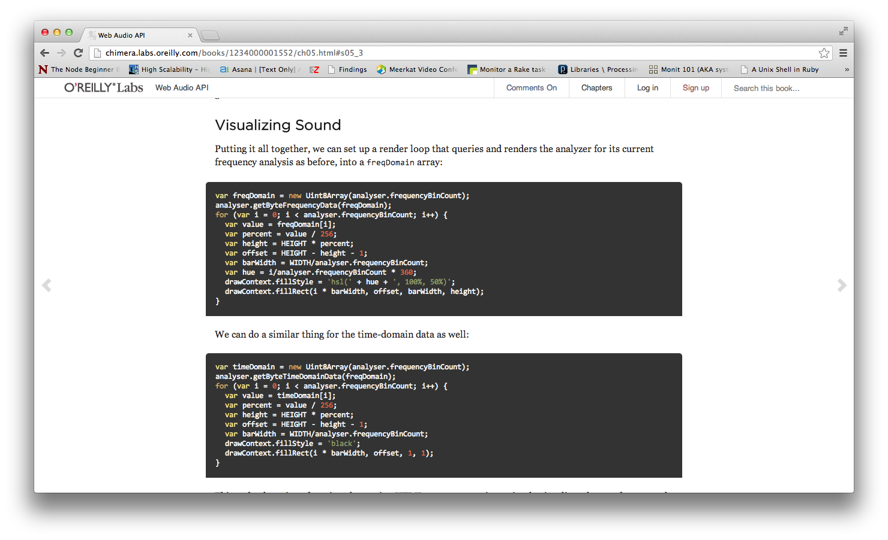
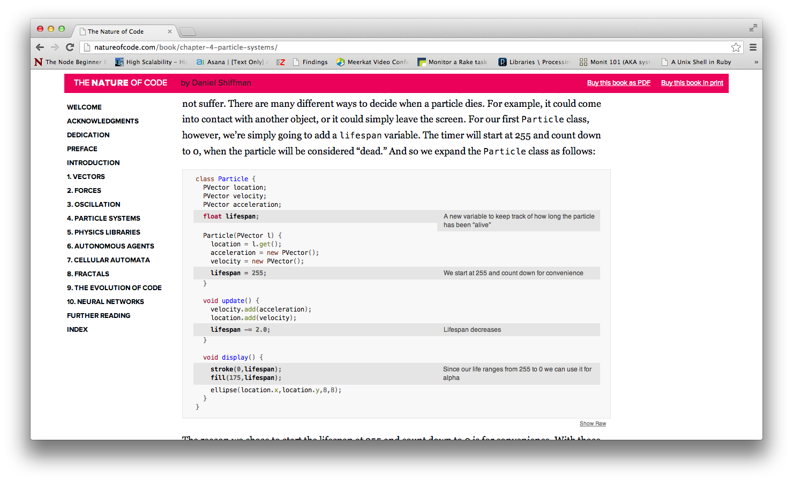
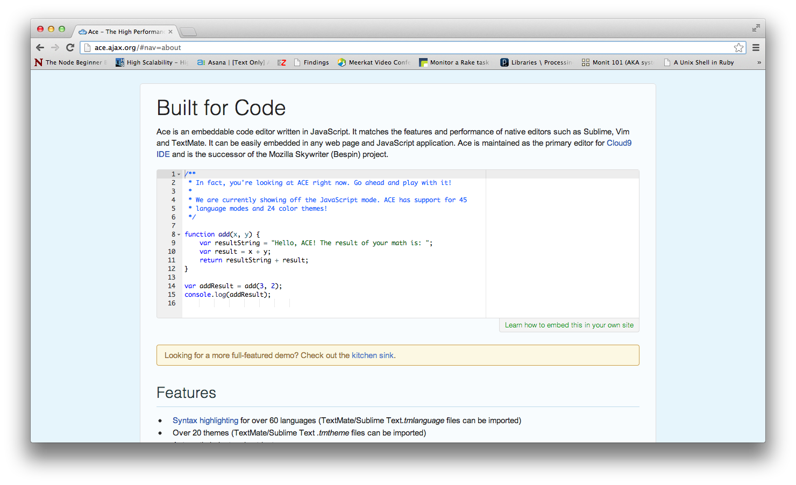

Formatting and Annotation
=========================

This category covers the different ways that code is either formatted or
annotated. This can take the form of color coding the syntax, or pulling
out comments to create new documentation. Examples include:

Syntax Highlighting
-------------------

### Pygments

[Pygments](http://pygments.org/) is a post-processor that applies syntax
highlighting for a wide range of languages. (Some 200+ are supported.)
The key advantage is that it makes code more readable.

### Opal

[Opal](http://wiki.freitagsrunde.org/Opal_Syntax-Highlighting) is
another highlighter. Dan Allen has taken an interest [in this
project](https://github.com/opal/opal/pull/246) and may use it with
asciidoctor.

Docco
-----

[Docco](http://jashkenas.github.io/docco/) is a Jeremy Ashkenas project
that takes comments embedded in source code and turns them into
annotations that appear on the sidepanel of the listing. This allows the
reader to more easily scan the code and read the comments in a way that
is visually more appealing than having the comments appear purely
inline.

Ace Editor
----------

The [Ace Editor](http://jashkenas.github.io/docco/) is a text editor
built in the style of textmate or sublime. It has a number of useful
features, like syntax highlighting (around 15 languages), line
numbering, a rich API, and a robust set of themes. A number of sites use
it to show listings, even if all you can do is copy the code from the
box.

