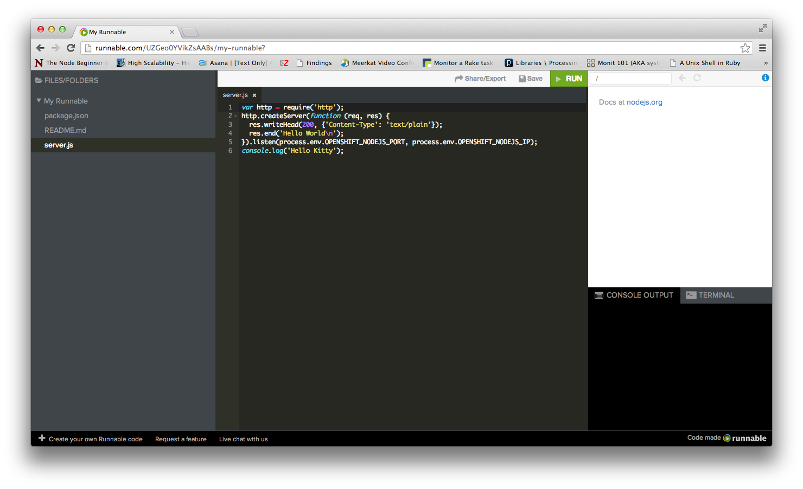

Live Stack
==========

The "live stack" is a full stack environment that runs either in the
browser or as a virtual machine. It’s the most sophisticated and
flexible of all the environments, but also the most complex. Unlike
tools like Codecademy or JSBin, a live stack has a number of different
tools, such as a database, development tools, startup services, an
editor, and other tools required to run a complete application. In many
ways, a live stack is everything required to run a complete development
environment.

Runnable.com
------------

[Runnable](http://runnable.com/) is an IDE and execution environment
built into the browser. It provides an Ace-like editor, a file manager,
and the ability to push code to a server for execution. In many ways,
it’s sort of like an Atlas for Heroku — you can write code in the IDE
and push it so that it runs live. It supports a number of target
languages, include Node, PHP, Ruby, and Python.

Heroku
------

[Heroku](http://www.heroku.com) is a platform as a service that allows
you to easily deploy an specific platform using git. When you push the
repo up, Heroku determines which platform you’re using and provisions
the machine accordingly. For example, if your app uses a Rails, Heroku
will provision a server with a rack-server, install your gem bundles,
and start the service. Heroku also has an extensive ecosystem of add on
services, such as databases, email, and caching solutions.

VirtualBox
----------

[VirtualBox](https://www.virtualbox.org/) is a free tool for running
virtual images. With Virtualbox, you can run a fully, preconfigured
machine image that has been set up with a complete stack of services.
All data, software, and startup information can be pre-configured. Once
the image is downloaded, the machine image runs completely locally. The
advantage is that Virtualbox allows you to ship a completely custom
environment that an end user can download and run.

Vagrant
-------

[Vagrant] is a tool that simplifies the process of using Virtualbox.
One key feature is that Vagrant can execute a puppet or chef script when
it is started, allowing you to easily ship the recipe for the machine,
rather than the machine image itself.

Post suggestions or comments here.
