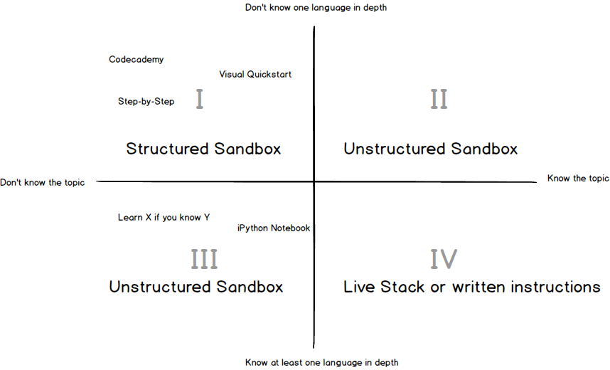

# Code As Media, Andrew Odewahn

This is a catalog of sites where code is a media object in and of its
own right. We’re not interested so much in the code itself (i.e., does
it work, how does it perform, etc), but how do we communicate **about**
code: what are the best ways to see, learn, and understand a topic.
People are learning in new ways, and we want to understand the patterns
that are emerging.

Each chapter covers a specific pattern, along with multiple sample sites
that show the ideas in action. The goal is to begin to build a common
vocabulary to think about new ways people are learning to code and to
understand the range of projects across the web. The current patterns
are:

-   [Unstructured Sandbox](/unstructured_sandbox). An unstructured
    sandbox allows you to try your code right in the browser, but does
    not force or require you to take any specific actions before you can
    proceed to the next step.

-   [Structured Sandbox](/structured_sandbox). Sites that provide a
    structured sandbox also allow you to try code in the browser, but
    proscribe how you step through material. You typically have a very
    specific exercise to complete before you can proceed to the next
    step in the learning process.

-   [Live Stack](/live_stack). Examples of full language and tool
    stacks, that might either be in-browser, PaaS, or
    downloadable environments.

-   [Sharing](/sharing). Examples of how code can be shared with others
    for commentary and discussion.

-   [Formatting and Annotation](/formatting_and_annotation). Examples of
    decorating the code listing for improved readability.

-   [Execution and Flow](/execution_and_flow). Examples that illustrate
    how the execution or structure of code.

-   [Finding and Searching](/finding_and_searching). Examples of sites
    related to finding specific examples or reference material.

-   [Evolution](/evolution). Examples of how code is shown to change or
    evolve over time.

Each pattern has 4 to 5 canonical examples. The final chapter lists
sites that apply these ideas, or are just really interesting. You can
find this at:

-   [Projects](/projects)

Segmenting Learners {#_segmenting_learners}
-------------------

We think of "beginner" and "expert" in a topic rather one dimensionally.
You’re either a beginner in JavaScript, or you’re an expert. But, there
are really two dimensions: the one we just noted (someone’s knowledge of
a specific topic) and the background knowledge they already bring to
that area. ? illustrates this breakdown.

Here are a few observations on the 4 quadrants:

-   Quadrant I is for people who don’t know a language and don’t have
    any prior experience. This is probably Codecademy’s core
    audience — people seeking step by step with as few distractions
    as possible. So, things like "Download this file and run something
    in the terminal" or "Open the file in a text editor" are way beyond
    what their capacity. They’ve never even heard of this stuff. This is
    why codecademy is so compelling to these people — you can get an
    immediate win without being frustrated by a bunch of things you
    don’t know.

-   Quadrant II is for people who have become familiar with a topic, but
    they’ve not really deeply mastered it in any way. So, you might have
    gone through all the Codecademy courses and earned all the badges,
    but you still have no idea what a text editor is, how to use git (or
    maybe even a command line), or git. Basically, you know a tool but
    not the whole ecosystem of tools required to actually do
    anything useful. This might also be where first year ITP students
    are — you can do some great stuff in a contained environment like
    processing, but there’s a host of other background info (git,
    heroku, sublime, data structures, etc) that you haven’t
    quite mastered.

-   Quadrant III is for people who are starting to learn a new topic,
    but they’ve already mastered one other toolset in it’s entirety. So,
    these are people who are new to Ruby, but already know Python. You
    don’t have to tell people how to use a text editor or what the
    command line is — they already know it and it’s assumed. For these
    people, an unstructured sandbox is fine — they want to focus on the
    language or idea, and they’ll worry about the environment later.
    They might also want a virtual image to play around with that’s
    already pre-configured, just to jumpstart the process.

-   Quadrant IV is for people who are experts in a topic and also deeply
    understand the tools. These are people for whom a virtual image is a
    convenience, but they’d probably be just as happy with some
    minimalist instructions. These are people,in Adam’s earlier comment,
    are reading entire books about pointers in C.

## Contributing

This book is licensed under a [Creative Commons Attribution-NonCommercial 4.0 International License](http://creativecommons.org/licenses/by-nc/4.0/).  I encourage you to fork my work and make your own improvements under the terms of the license. If you have any changes you want to send back our way, please make a regular pull request via Github. If the authors like your changes, they may integrate them into the official repo and give you a credit. If you just have an issue to report, please use the regular Github issue system.

## Running the site locally

The site uses [harpjs](http://harpjs.com/) to build a site and [Atlas](https://atlas.oreilly.com/) to build the PDF, mobi, and epub.  To build the site:

* [Install harp](http://harpjs.com/docs/quick-start).  
* Clone the repo
* Run `harp server --port 4567`

When you want to build the site, clone the repo down again into another directory, create a gh-pages branch, and then run `harp compile . _new directory_`
