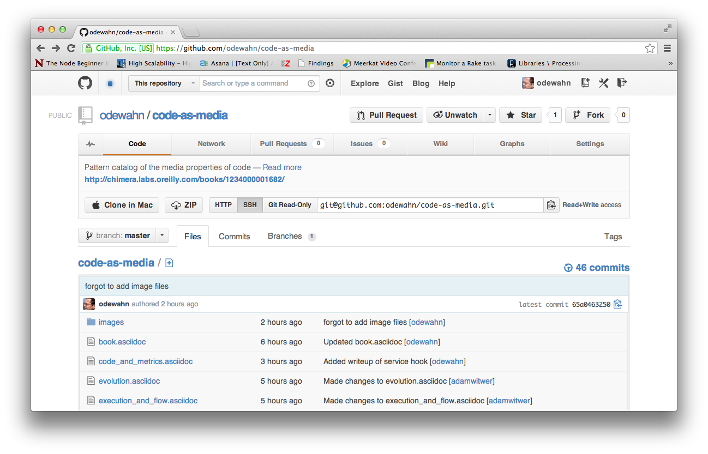
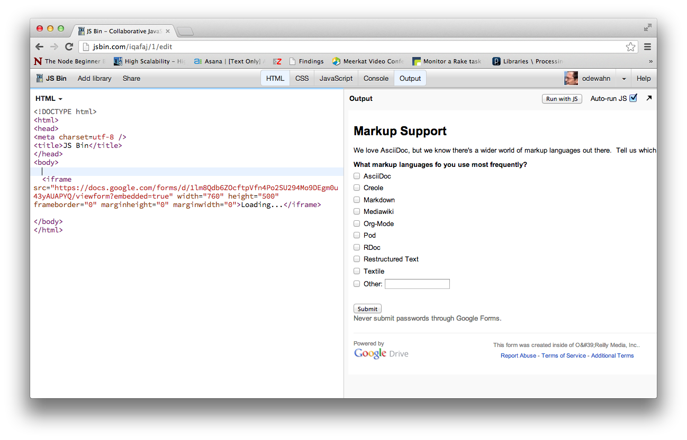
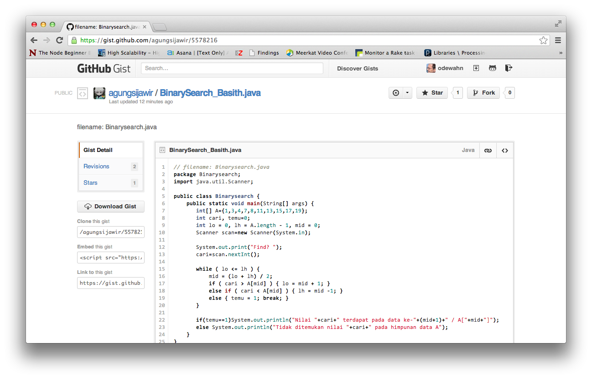

Sharing
=======

The sharing category covers different ways that people share code to
others (duh!). They can range from simple (like posting something on a
blog) to complex, but the basic idea is that these are ways people send
out snippets or full worked examples and get feedback.

Blogging / Static site
----------------------

This is probably the classic method for sharing ideas about code, but
it’s worth mentioning: simply blogging about it. There are a lot of
great developers ([Bret Victor](http://worrydream.com/), etc) who write
beautifully about development. Many of the tools mentioned here are
designed to complement blogging in one way or the other.

GitHub
------

[GitHub](http://www.github.com) is a site for sharing entire code
repositories. Unlike some of the other tools mentioned here, which are
more around sharing snippets or small examples, github is used to host
the entire codebase for a project. in addition to hosting the git repos,
it also handles collaborators, issues, wikis, forking, pull requests,
and all the other elements required to run an open source project.

JSBin
-----

[JSBin](http://jsbin.com/) (and the similar site,
[JSFiddle](http://jsfiddle.net/)) allow you to create snippets of
Javascript, HTML, CSS, and a live preview that shows the output. Once
you create your snippet, you can then embed onto other sites. Think of
it as a sort of YouTube for Javascript. The viewer has the option to
copy it into their own account and make changes, as well. This has
become a useful tool in the JavaScript community for sharing prototypes
and ideas.

Gists / pastebin
----------------

[gist](https://gist.github.com) and [pastebin](http://pastebin.com/) are
services for sharing snippets of code or text. (Some people even write
whole essays with them.) Once you create the snippet, you can get an
embed code that you can use to embed the code onto a blog or other site.
People can then copy the gist to their own account so that they can
modify it.

Post suggestions or comments here.
