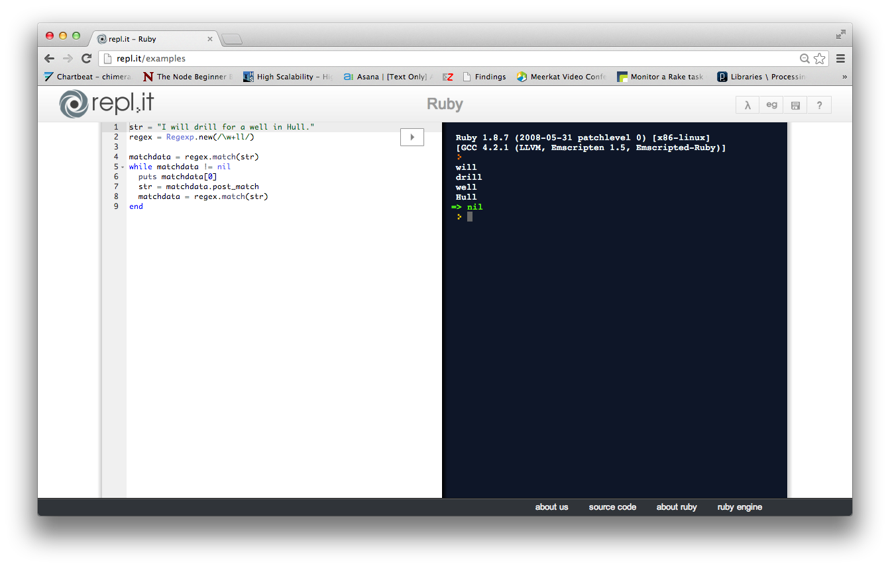
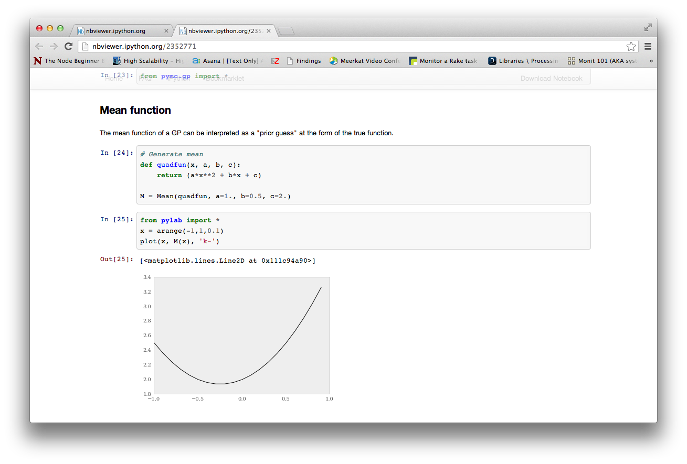
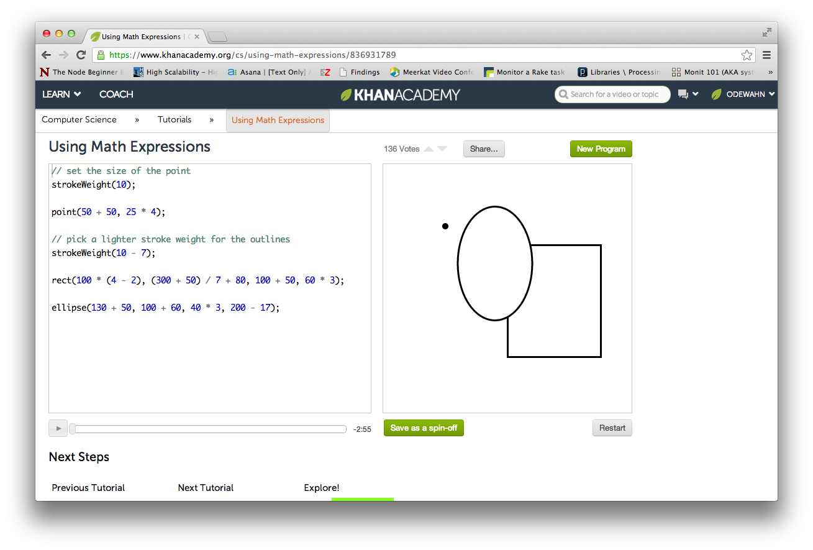
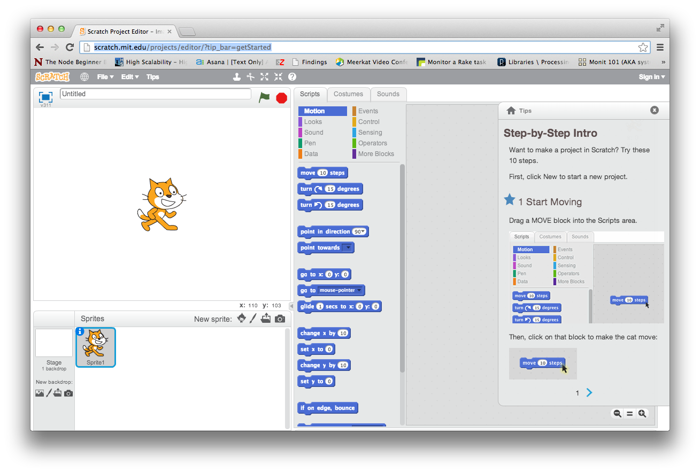
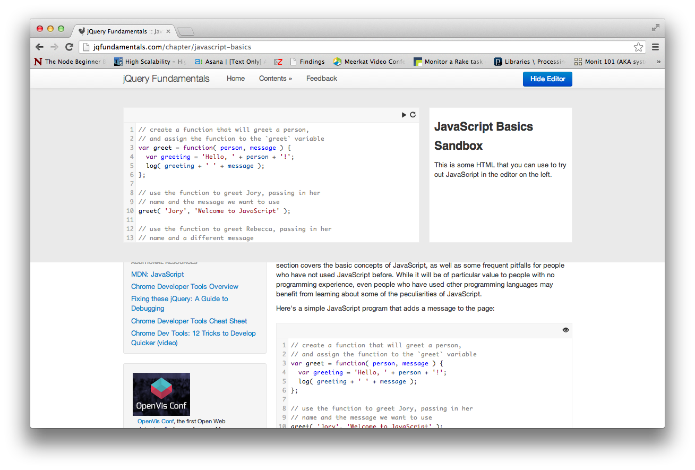
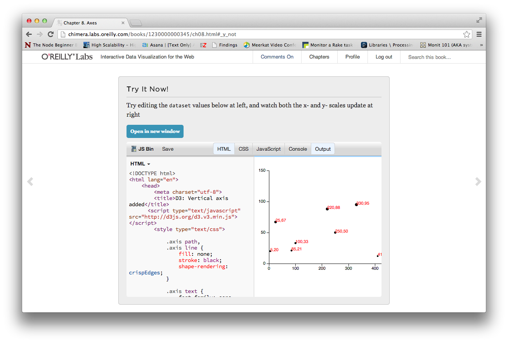
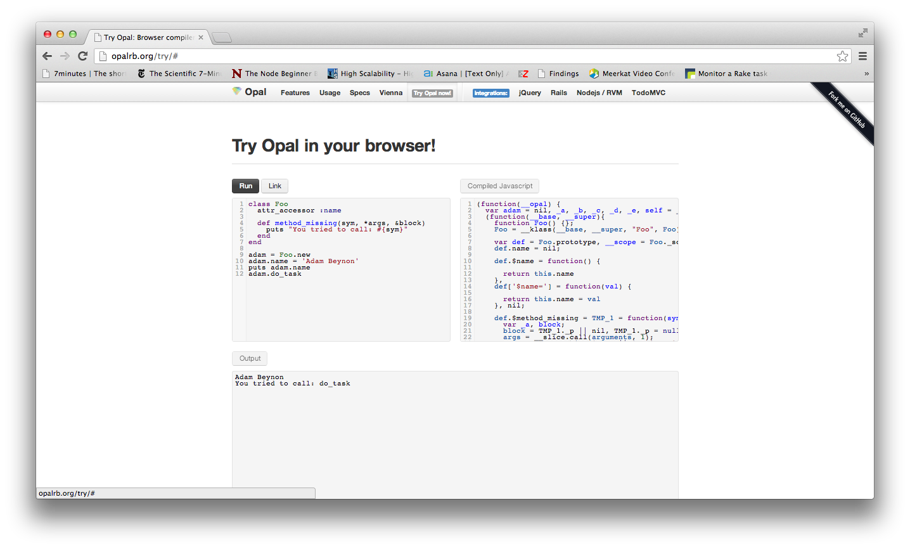
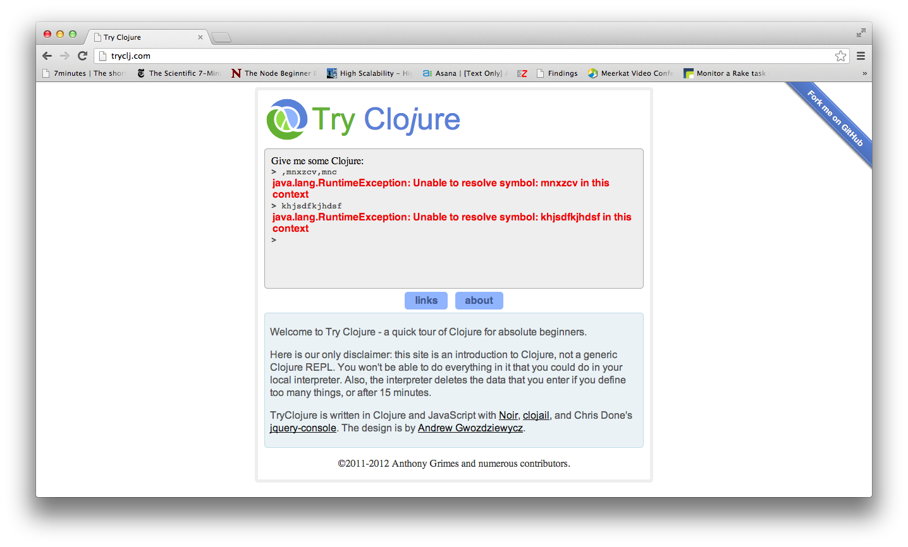
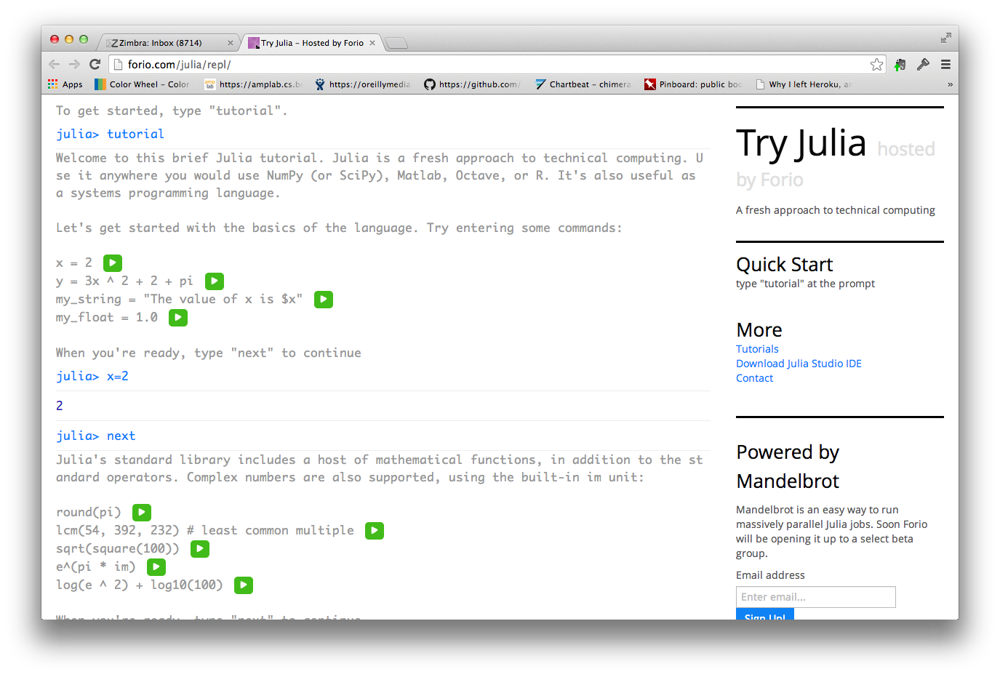
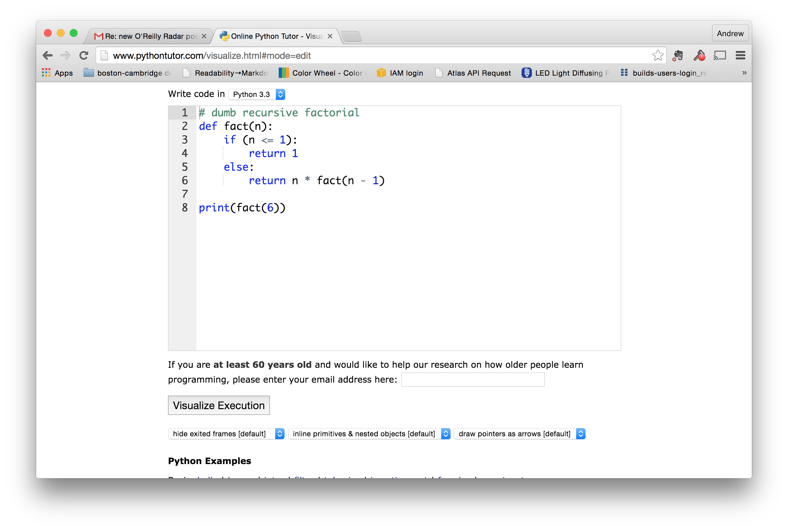

Unstructured sandbox
====================

An unstructured sandbox provides an open ended, terminal-like model for
entering and executing code. These terminals can be embedded inline in
the page, opened with a click of a button, or iframed into the structure
of the overall documents.

-   Strengths

    -   Editorial flexibility — allows the author to insert whatever
        types of content he or she will best describe the topic

-   Weaknesses

    -   Design inflexibility. These often appear as iframes or something
        disruptive to the overall experience.

    -   Non-integrated. Unless care is taken, the sandbox can feel like
        an editorial afterthought.

Examples include:

repl.it
-------

[repl.it](http://repl.it/) is a tool that uses various compiled
languages (Python, Ruby, and Lua, among others). The site offers a code
runner, an output pane, a surprisingly wide selection on languages, and
a nice selection of samples for each type.

Programr
--------

[Programr](http://www.programr.com/) runs languages in the browser
including console (C++, C\#, Java, Objective-C), web (PHP, Javascript,
JQuery, Java Server Pages, AJAX), rich media (Flex, Processing), desktop
(Java Swing), and database (SQL, SQLite). Others on the site include
Ruby, Python, VB, AJAX, Flex, Flash, iOS, Android, and more.

**Andrew’s analysis:** "though it supports a pretty wide selection of
languages, performance it pretty terrible. Like, check out these ruby
examples:

<http://www.programr.com/append-and-concatination>
<http://www.programr.com/using-loop-1>

They each take 9-10 seconds to evaluate."

Twilio Pair Programming
-----------------------

<http://www.twilio.com/blog/2013/06/pair-programming-in-the-browser-with-twilio.html>

The tools for creating real-time applications in the browser are getting
better all the time. Running node.js on the server, in conjunction with
libraries like socket.io, makes it ridiculously simple to facilitate
server push and event-driven communication between clients. Combine this
with Twilio Client for voice communication in the browser and you have
an incredibly powerful platform for facilitating communication between
users of your application.

Pair programming live with a distributed team is very much a possibility
with some of the technologies we’ll look at today. Let’s run through a
list of ingredients for this hack: \* node.js on the server \* The
official twilio node module, available on npm \* The Twilio Client
JavaScript SDK (for the browser) \* socket.io (both server and browser)
\* Express for routing HTTP requests and serving up responses \* Ace
code editor (browser) \* AppFog (platform as a service for hosting)

IPython Notebook
----------------

[IPython Notebook](http://ipython.org/notebook.html) is a tool for
viewing python in the browser. The author writes in an integrated
environment (the native format is JSON) that allows text, equations, and
live code. (The code executes on a remote server.) The output of the
code is presented in a terminal style format. One of the other really
nice features is that it is simple to embed images, like those generated
from numerical or scientific tools like numpy or scipy.

Khan Academy
------------

[Khan Academy](https://www.khanacademy.org) provides a vast array of
learning classes around basic computer science. There are typically a
video or animation for each step, after which the student is able to
experiment with the code in the sandbox. The coding environment is
divided into a pane for listing and a pane for the output, where the
student can see the result. (Currently, only Javascript-based languages
seem to be supported.) The code environment also supports a "Save as a
spin off" button where the user can save the code listing to his or her
own private account for modification.

Scratch
-------

[Scratch](http://scratch.mit.edu/projects/editor/?tip_bar=getStarted) is
an interactive learning environment geared towards kids. The user edits
code in an IDE-like window. Tips, instructions, and tutorials can be
appear in a sidepanel called "Tips" that can be turned on or off. The
user can also save their programs (which are often like small animations
or movies) so that they can be shared.

JQFundamentals
--------------

[jqfundamentals](http://jqfundamentals.com/)is a site for teaching
javascript. It walks through a rich set of concepts that are illustrated
with specific code examples. You can click on a small icon on the
example to open a live code editor where you can run the example.

Chimera
-------

[O’Reilly Chimera](http://chimera.labs.oreilly.com/) is a new beta site
for experimenting with how books can become more interactive. At it’s
current start of development, the site has embedded JSBins that allow
the reader to try out the code. (Javascript only.)

Opal
----

[Opal](http://opalrb.org/) is a ruby to javascript compiler. It is
source-to-source, making it fast as a runtime. Opal includes a compiler
(which can be run in any browser), a corelib and runtime implementation.
The corelib/runtime is also very small (10.8kb gzipped).

try clojure
-----------

[Try Clojure](http://tryclj.com/) is an online sandbox for using
Clojure, a dynamic programming language that targets the Java Virtual
Machine (and the CLR, and JavaScript). It is designed to be a
general-purpose language, combining the approachability and interactive
development of a scripting language with an efficient and robust
infrastructure for multithreaded programming.

forio julia tutorial
--------------------

[Julia Tutorial](http://forio.com/julia/repl/) is an interactive
tutorial for the julia language. It’s sturcuted as a command-line style
tutoral, where the user can tye commands like "tutorial" or "next" that
prompt you to try specific elements of the language.

## Python Tutor

http://www.pythontutor.com/ is a tool for learning Python, Java, JavaScript, TypeScript, and Ruby. So far, over 1.2 million people have used this tool for self-learning, often in conjunction with taking MOOCs and reading online textbooks.

